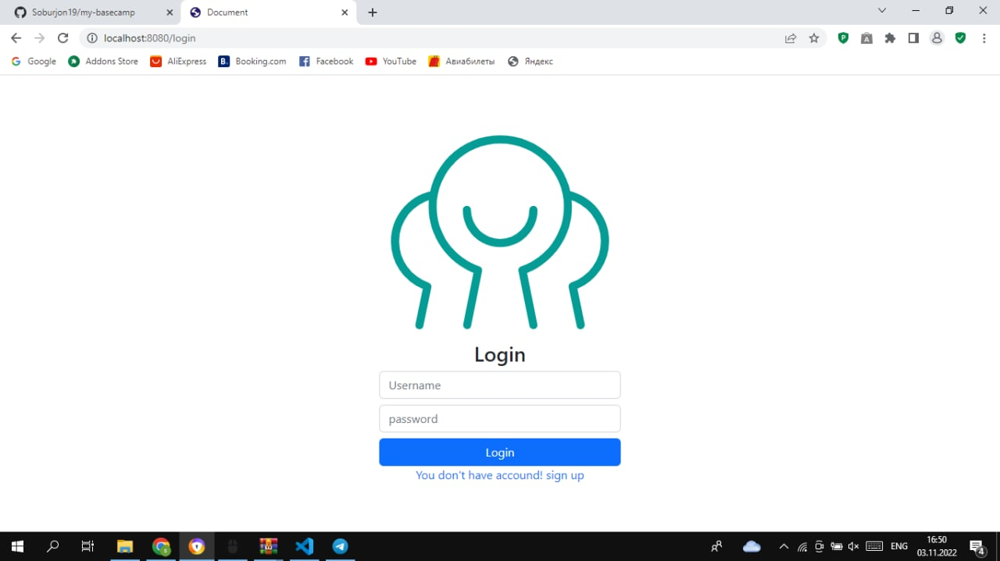

# Welcome to My Basecamp
Expressjs & sqlite3 project

# Demo
<a href="https://my-basecamp-2-production.up.railway.app/">Basecamp 2 </a>

### install this project
```
npm install && npm i nodemon -g
```

### Running server for development
```
npm start dev:start
```
### Or run server for review
```
npm start
```
# Abilities 


<ul>
<li>Auth</li>
</ul>

<p>If you don't have an account, you can create one.</p>

<ul>
<li>Add Project</li>
</ul>

<ul>
<li>Edit Profile</li>
</ul>

